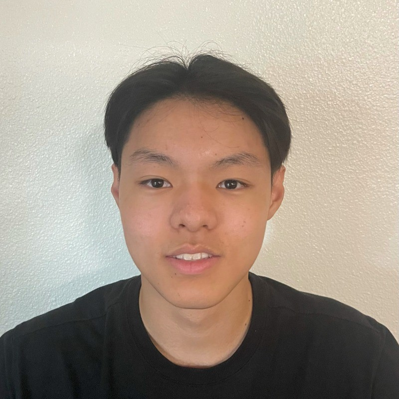

# Aaron's User Page

## Table of Contents
- [Aaron's User Page](#aarons-user-page)
  - [Table of Contents](#table-of-contents)
    - [About Me](#about-me)
    - [My Headshot](#my-headshot)
    - [Visit My LinkedIn](#visit-my-linkedin)
    - [My Favorite Bible Verse](#my-favorite-bible-verse)
    - [Code Examples](#code-examples)
    - [Ordered Watch List](#ordered-watch-list)
    - [Unordered List of Programming Languages](#unordered-list-of-programming-languages)
    - [Stylings](#stylings)
    - [Lab Task List](#lab-task-list)

### About Me
Hello, I am second-year student at UCSD majoring in Computer Science and minoring in Mathematics.

### My Headshot


### Visit My LinkedIn
[LinkedIn](https://www.linkedin.com/in/aaronchiuwei/)

### My Favorite Bible Verse
> "Cast all your anxieties on him, because he cares for you" 1 Peter 5:7

### Code Examples
`inline code`

```javascript
// code block
function helloWorld() {
  console.log("Hello, world!");
}
```

### Ordered Watch List
1. Paradise
2. White Lotus
3. How To Make Millions Before Grandma Dies

### Unordered List of Programming Languages
- Python
- Java
- C++
- C
- MATLAB
- SQL
- Scheme
- JavaScript
- CSS
- HTML
- ARM Assembly

### Stylings
<br>*italic*
<br>**bold**
<br>***bold and italic***

### Lab Task List
- [x] Lab 1
- [ ] Lab 2
- [ ] Lab 3